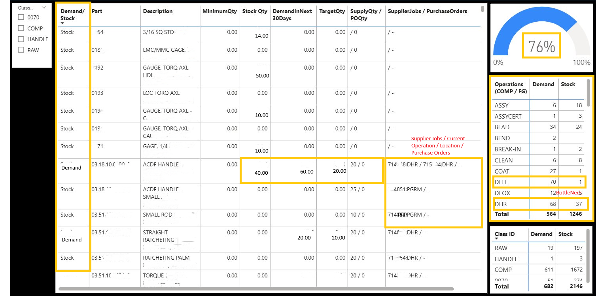

# 📦 Supermarket Status — Power BI Dashboard

A Power BI dashboard built for the **Supply Chain, Planning, and Procurement team** to monitor inventory demand in real time. It separates parts with active demand due within 30 days from parts built to stock, enabling faster prioritisation and expediting decisions.

---

## 📸 Dashboard Preview



---

## 🎯 Business Need

Before this dashboard, planners had no single view to distinguish urgently needed parts from stock-level builds. This report solves:

- Identifying which parts have **active demand vs. stock** status
- Prioritising **expediting efforts** across a large parts catalogue
- Combining job supply, purchase orders, and on-hand quantities in one place
- Measuring overall **inventory health** as a single metric

**Primary Users:** Supply Chain Manager · Planning & Procurement Team  
**ERP System:** Epicor Kinetic

---
## 📈 Impact **Before this dashboard:** 
- Planners spent 2-3 hours daily distinguishing urgent parts from stock builds via manual spreadsheets
- No single source of truth; data scattered across ERP, email, and local files - Expediting decisions were reactive, not data-driven
-  **After deployment:** - Reduced manual planning time by ~10-12 hours/week per planner (2-3 hours/day → 15-20 minutes/day)
- Single-view inventory health metric enables faster prioritization
-  Inventory visibility enables better demand forecasting and stock optimization
-  **Quantified ROI:** - ~10 hours/week saved across planning team = $250/week productivity gain 
---

## 📊 Visuals (1 Page, 5 Visuals)

| # | Visual | Type | Purpose |
|---|--------|------|---------|
| 1 | Parts Detail Table | Table | Per-part view: status, quantities, supplier jobs, POs |
| 2 | Inventory Health | Gauge | % of parts with sufficient stock coverage (76% = healthy) |
| 3 | Operations Matrix (COMP/FG) | Matrix | Demand vs. Stock count by production operation code |
| 4 | Class ID Summary Matrix | Matrix | Demand vs. Stock count by part class (RAW, COMP, HANDLE, 0070) |
| 5 | Class ID Slicer | Slicer | Filter all visuals by part classification |

---

## 🗄️ Data Sources

| Source | Type | Description |
|--------|------|-------------|
| Epicor Kinetic (via Dataflow) | Power Platform Dataflow | `Parts_Sply_Dmd` entity — demand, supply, job & PO detail |
| Part-BAQ | Power Platform Dataflow | Part master data: ClassID, ProdCode, Description, MinimumQty |
| StkStat.csv | SharePoint CSV | Unit cost & extended cost for inventory valuation |

---

## 🧮 Key Logic

### Demand / Stock Classification
A part is classified as **Demand** when its `TargetQty > 0` AND demand within 30 days exceeds on-hand stock:

```
TargetQty =
  if Demand_Next30Days > OnHandQty  →  (Demand + MinimumQty) - OnHand
  else if MinimumQty > OnHandQty    →  MinimumQty - OnHand
  else                              →  0

Demand/Stock =
  if TargetQty > 0 and Demand > OnHand  →  "Demand"
  else                                  →  "Stock"
```

### Inventory Health (DAX)
```dax
InventoryHealth =
VAR StockParts  = CALCULATE(DISTINCTCOUNT('DemandInNext30Days/Stock'[PartNum]),
                    'DemandInNext30Days/Stock'[Demand/Stock] = "Stock")
VAR DemandParts = CALCULATE(DISTINCTCOUNT('DemandInNext30Days/Stock'[PartNum]),
                    'DemandInNext30Days/Stock'[Demand/Stock] = "Demand")
RETURN StockParts / (StockParts + DemandParts)
```
Format: `0%;-0%;0%`

---

## 🗂️ Repository Contents

```
SuperMarket-Status-PowerBI/
│
├── README.md                                        ← You are here
├── dashboard_screenshot.png                         ← Full dashboard preview
├── Supermarket_Status_Dashboard_Documentation.docx  ← Full technical documentation
│
├── model.tmdl                                       ← Semantic model definition
├── relationships.tmdl                               ← Table relationships
├── expressions.tmdl                                 ← Power Query (M) data source expressions
├── Demand_StockOperations.tmdl                      ← Demand/StockOperations table
└── DemandInNext30Days_Stock.tmdl                    ← DemandInNext30Days/Stock table (primary)
```

> **Note:** All workspace IDs, dataflow GUIDs, and SharePoint URLs have been replaced with placeholders (e.g. `[WORKSPACE_ID_2]`) for security. Replace these with your own environment values before connecting.

---

## 🔗 Relationships

| From | To | Cross-Filter |
|------|----|--------------|
| `Demand/StockOperations[Key]` | `DemandInNext30Days/Stock[Key]` | Both directions |
| `Refresh TimeStamp[Refresh TimeStamp]` | `LocalDateTable[Date]` | Single (date part only) |

---

## 🏷️ Part Classifications

| Class ID | Description |
|----------|-------------|
| `RAW` | Raw materials |
| `COMP` | Components |
| `HANDLE` | Handle parts (ProdCode 200, 602, 603) |
| `0070` | Class 0070 parts |

---

## 📄 Documentation

Full technical and functional documentation is available in:  
📘 [`Supermarket_Status_Dashboard_Documentation.docx`](Supermarket_Status_Dashboard_Documentation.docx)

Covers: Business Need · Data Sources · Tables · Relationships · Power Query Logic · DAX Measures · Visual Descriptions · Glossary

---

*Built with Power BI · Epicor Kinetic · Power Platform Dataflows*
